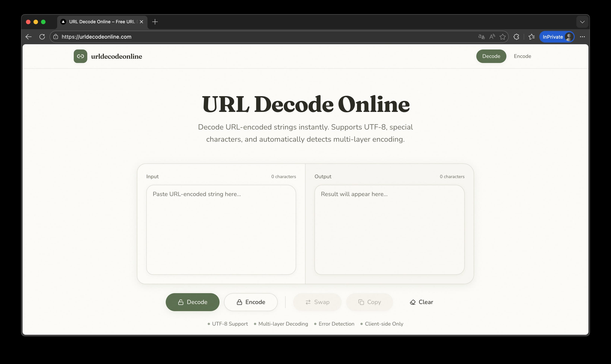

# URL Decode Online

**URL Decode Online** 是一个快速、干净、可靠的在线 URL 解码与编码工具。

🌐 在线访问： [https://urldecodeonline.com](https://urldecodeonline.com)

---

## 这个项目是什么？

URL Decode Online 是一个为开发者打造的 Web 工具，用于对 URL 编码字符串进行解码和编码，适用于处理查询参数、API 请求、重定向链接以及各种被转义的 URL 数据。

它可以帮助你：

* 将 URL 编码的字符串还原为原始文本
* 将普通文本编码为可安全用于浏览器和接口的 URL 格式
* 正确处理 UTF-8 和多字节字符
* 自动解析多层 URL 编码（例如 `%2520` → `%20` → 空格）

所有操作都在浏览器本地完成，不会上传任何数据。

---

## 为什么要做这个工具？

目前很多在线 URL 工具存在这些问题：

* 页面广告多、加载慢
* 对中文和 UTF-8 支持不完整
* 无法正确处理多层编码
* 操作繁琐，不适合日常调试

URL Decode Online 的目标是提供一个：

> 简洁、快速、对开发者友好的 URL 编码与解码工具。

---

## 功能特点

* 🔁 URL 解码与编码
* 🌍 支持 UTF-8 与多语言字符
* 🧩 自动多层解码
* 📋 一键复制、交换、清空
* ⚡ 本地即时处理，无需等待
* 🧼 干净无广告的界面

---

## 适用场景

这个工具适合用于：

* 调试 API 请求和查询参数
* 分析追踪链接与跳转 URL
* 处理 OAuth、Webhook 和回调地址
* 生成安全可用的 URL 参数

---

## 界面截图

---

## 在线使用

直接访问网站即可使用：
👉 [https://urldecodeonline.com](https://urldecodeonline.com)

无需注册，完全免费。

---

## 技术栈

网站基于以下技术构建：

* Next.js
* React
* TypeScript
* Tailwind CSS
* 部署在 Vercel

所有编码与解码逻辑均在客户端完成。
